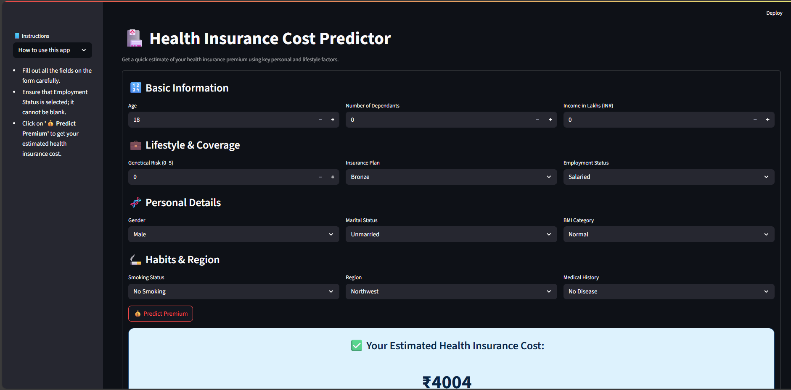

# 💼 ML Premium Prediction System

This project aims to predict premium amounts based on customer features such as age group, region, and health metrics. It includes multiple Jupyter notebooks exploring different modeling approaches, as well as a streamlined prediction pipeline (`main.py`) for real-world use.

---
## 🔗 Live Demo

You can try the **Health Insurance Premium Predictor** app here:  
👉 [Health Insurance Premium App](https://healthinusrancepremiumsarthakmaddi.streamlit.app/)
---
Built with:
- 🐍 Python
- 🧠 Scikit-learn
- 📊 Pandas & NumPy
- 🎯 Streamlit (for interactive UI)

---

## 📁 Project Structure

```
.
├── app.py                       # Streamlit web app
├── predcition_helper1.py       # Backend prediction + preprocessing
├── requirements.txt            # Python dependencies
├── README.md
├── artifacts/                  # Trained models and scalers
│   ├── model_young.joblib
│   ├── model_rest.joblib
│   ├── scaler_young.joblib
│   └── scaler_rest.joblib
├── notebooks/                  # Training and analysis notebooks
│   ├── ml_premium_prediction.ipynb
│   ├── ml_premium_prediction_rest.ipynb
│   ├── ml_premium_prediction_rest_with_gr.ipynb
│   ├── ml_premium_prediction_Young.ipynb
│   └── ml_premium_prediction_Young_with_gr.ipynb
```

---

## 🧠 Models

| Model Type | Age Group | Preprocessing |
|------------|-----------|----------------|
| Linear Regression | Age ≤ 25 (`model_young`) | StandardScaler |
| XGBoost Regression | Age > 25 (`model_rest`) | StandardScaler |

---
<details>
<summary><strong>📓 Notebooks Overview</strong></summary>

- [`ml_premium_prediction.ipynb`](notebooks/ml_premium_prediction.ipynb): Baseline model.
- [`ml_premium_prediction_rest.ipynb`](notebooks/ml_premium_prediction_rest.ipynb): REST group focus.
- [`ml_premium_prediction_rest_with_gr.ipynb`](notebooks/ml_premium_prediction_rest_with_gr.ipynb): REST + Gradient Boosting.
- [`ml_premium_prediction_Young.ipynb`](notebooks/ml_premium_prediction_Young.ipynb): Young group model.
- [`ml_premium_prediction_Young_with_gr.ipynb`](notebooks/ml_premium_prediction_Young_with_gr.ipynb): Young + Gradient Boosting.

</details>

---
## 🚀 How to Run

### 🔧 Install dependencies

```bash
pip install -r requirements.txt
```

### ▶️ Launch the app

```bash
streamlit run app.py
```

---

## ✅ Inputs Considered

- Age
- Number of Dependents
- Income (in Lakhs)
- Insurance Plan (Bronze/Silver/Gold)
- Employment Status
- Gender, Marital Status
- BMI Category
- Smoking Habits
- Genetical Risk (0–5)
- Medical History (e.g., "Diabetes & Heart disease")
- Region

---

## 📦 Outputs
- Predicted Health Insurance Premium in ₹
- Personalized UI + prediction result with styling
  

## ⚠️ Disclaimer

This project is intended for educational and demonstration purposes only. The models and predictions made by this system are based on sample data and may not reflect real-world scenarios accurately.

- Do **not** use this model for actual insurance premium calculations without thorough validation.
- The dataset used in this project is **not included** in the repository due to privacy or licensing constraints.
- The project does not collect or use any personal or sensitive information.
- The author assumes no responsibility for misuse or misinterpretation of the results.

Use responsibly and always validate with real-world domain expertise.
## 🧠 Analysis  
Check [analysis.md](analysis.md) for a full breakdown of EDA and modeling insights.

---

## 🙋‍♂️ Author  
**Sarthak Maddi**  
Feel free to connect or raise issues for collaboration.

---

## 📄 License  
This project is open-source and free to use under the MIT License.

